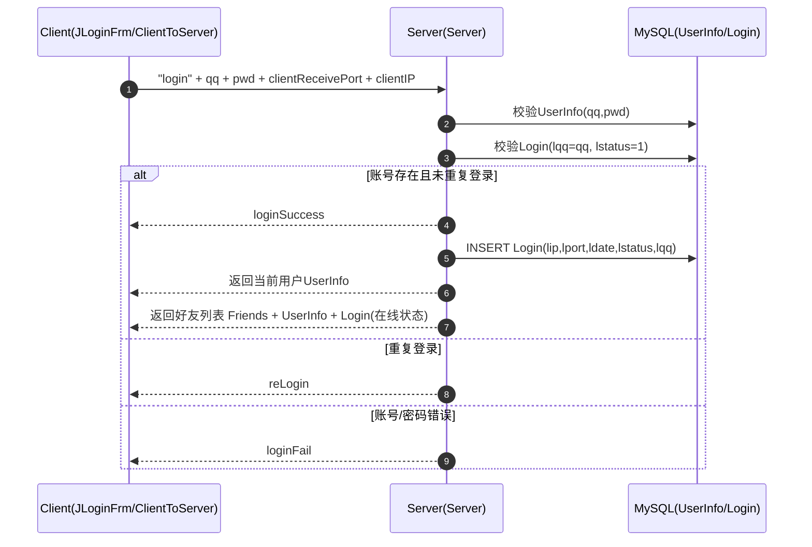
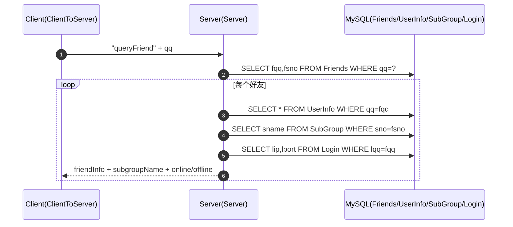

# 架构与流程图（Mermaid）

## 1. 总体架构

```mermaid
flowchart LR
  subgraph Client[QQClient（Swing）]
    UI[界面层：JLoginFrm/JMainFrm/JChatFrm]
    Ctl[控制层：com.controller.ClientToServer 等]
    Model[公共模型：com.common（Message/User/UserInfoBean 等）]
  end

  subgraph Server[QQServer（Socket + JDBC）]
    SFrame[服务端界面：ServerFrame]
    SListen[监听：ServerThread]
    SWorker[会话处理：com.controller.Server（Runnable）]
    DB[(MySQL: myqq)]
    DAO[DB工具：ConnectionFactory/Query/Dml]
  end

  UI --> Ctl -->|TCP Socket(DataInput/OutputStream)| SListen --> SWorker
  SWorker --> DAO --> DB
  Ctl <--> Model
  SWorker <--> Model
```

## 2. 登录流程



## 3. 好友列表拉取


